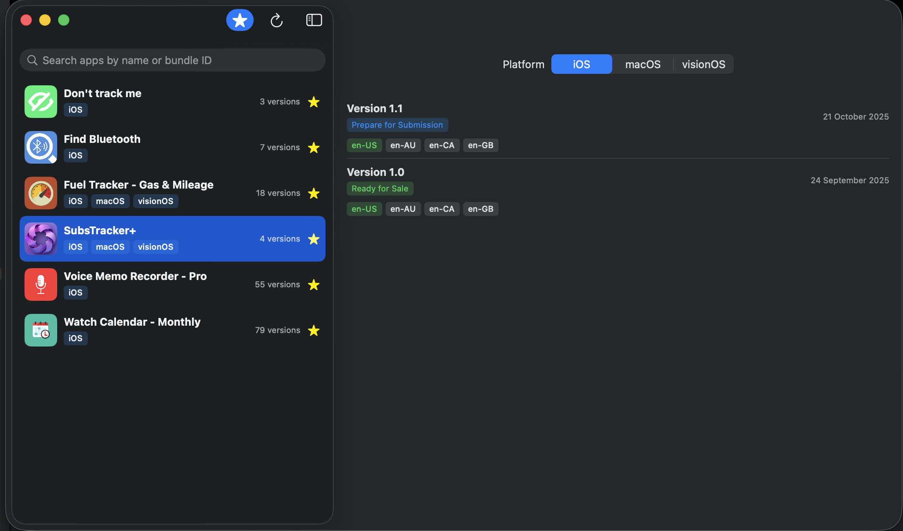
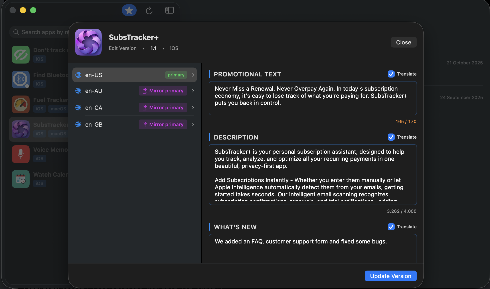

# AppStoreMetadataEditor

> A modern macOS application for managing App Store Connect metadata and localizations with AI-powered translation.

[](https://www.apple.com/macos/)
[](https://swift.org)
[](LICENSE)
[](https://developer.apple.com/xcode/swiftui/)

## Overview

AppStoreMetadataEditor is a native macOS application designed to streamline the management of App Store Connect metadata for developers. Built with SwiftUI and following MVVM architecture with protocol-based dependency injection, it provides a clean and efficient interface for editing app version localizations across multiple platforms.



## ✨ Features

### 🔐 Secure Authentication
- **JWT-based authentication** with App Store Connect API using ES256 signing
- **Keychain integration** for secure credential storage
- **Auto-authentication** on app launch with saved credentials

### 📱 Multi-Platform Support
- Manage apps across **iOS**, **macOS**, and **visionOS**
- Platform-specific version filtering with alphabetically sorted platforms
- Visual platform chips for quick identification

### 🌍 Localization Management
- Edit **6 metadata fields**: Promotional Text, Description, What's New, Keywords, Support URL, Marketing URL
- Support for **all App Store languages**
- **Dynamic base locale detection** from API
- Character limit validation with real-time feedback

### 🤖 AI-Powered Translation
- Integration with **OpenRouter API** (GPT-4o)
- **Batch translation** of multiple fields in a single API call
- **Selective field translation** via checkboxes
- **Mirror primary** feature for English locale variants (en-US, en-GB, en-CA, en-AU)
- Markdown-aware JSON parsing

### 🎯 Smart Features
- **Favorites system** for quick access to frequently used apps
- **Real-time search** by app name or bundle ID
- **App icon caching** via iTunes Search API
- **Version status indicators** with color-coded chips
- **60-second timeout** protection for slow API calls

### 🔄 Batch Updates
- Update **all localizations** for a version in one operation
- **Progress tracking** during batch operations (e.g., "Updating 3/10 localizations")
- Individual error handling per locale with detailed reporting



## 🏗️ Architecture

### MVVM with Protocol-Based Dependency Injection

The project follows a strict MVVM architecture with **zero direct singleton access**. All dependencies are injected via protocols through a central `DependencyContainer`.

```
┌─────────────────┐
│     Views       │
└────────┬────────┘
         │
┌────────▼────────┐
│   ViewModels    │
└────────┬────────┘
         │
┌────────▼────────┐
│   Protocols     │
└────────┬────────┘
         │
┌────────▼────────┐
│    Services     │
└─────────────────┘
```

**Key Protocols:**
- `AppStoreServiceProtocol` - App Store Connect API operations
- `TranslationServiceProtocol` - AI-powered translation
- `AuthServiceProtocol` - JWT token generation
- `KeychainManagerProtocol` - Secure credential storage
- `AppIconServiceProtocol` - Icon fetching and caching
- `FavoritesManagerProtocol` - Favorites persistence

## 🚀 Getting Started

### Prerequisites

- **macOS 26.0+**
- **Xcode 26.0+**
- **App Store Connect API credentials** (Issuer ID, Key ID, Private Key)
- **OpenRouter API key** (optional, for translation features)

### Building the Project

```bash
# Clone the repository
git clone https://github.com/yourusername/AppStoreMetadataEditor.git
cd AppStoreMetadataEditor

# Build with Xcode
xcodebuild -scheme AppStoreMetadataEditor -configuration Debug build

# Or open in Xcode
open AppStoreMetadataEditor.xcodeproj
```

### Configuration

1. **App Store Connect API Setup:**
   - Launch the app
   - Go to **AppStoreMetadataEditor → Settings...** (⌘,)
   - Navigate to **App Store API** tab
   - Enter your credentials:
     - Issuer ID
     - Key ID
     - Private Key (PEM format)
   - Click **Save**

2. **Translation Service Setup (Optional):**
   - Go to **Translation Service** tab in Settings
   - Enter your OpenRouter API key
   - Configure base URL and model (defaults to GPT-4o)
   - Toggle **Use Mock** for testing without consuming API credits

## 📖 Usage

### Managing Apps

1. **View Apps:** The main list displays all your apps with icons, bundle IDs, and platform chips
2. **Search:** Use the search bar to filter apps by name or bundle ID
3. **Favorites:** Click the star icon to mark/unmark apps as favorites
4. **Filter Favorites:** Toggle the star button in the toolbar to show only favorites
5. **Refresh:** Click the refresh button to reload the app list

### Editing Versions

1. **Select an App:** Click on any app in the list
2. **Choose Platform:** Use the segmented picker to filter by platform (iOS/macOS/visionOS)
3. **Edit Version:** Click on a version with status **"Prepare for Submission"**
4. **Update Fields:** Edit any of the 6 metadata fields across all localizations
5. **Translate:**
   - Select which fields to translate using checkboxes (base locale only)
   - Click individual **"Translate"** buttons per locale for selective translation
   - Use **"Mirror primary"** for English variants
6. **Save:** Click **"Update Version"** to save all changes

### Translation Features

- **Batch Translation:** Select multiple fields and translate all at once
- **Individual Translation:** Translate specific locales independently
- **Mirror Primary:** Copy all fields from primary English to other English variants
- **Progress Tracking:** Visual feedback during translation operations

## 🔧 Technical Stack

- **Language:** Swift 5.0
- **UI Framework:** SwiftUI
- **Architecture:** MVVM with Protocol-Based Dependency Injection
- **Concurrency:** async/await, actors, structured concurrency
- **Persistence:** Keychain (credentials), UserDefaults (settings, favorites)
- **APIs:**
  - App Store Connect API (REST)
  - OpenRouter API (GPT-4o)
  - iTunes Search API (icon fetching)

## 📝 API Endpoints

### App Store Connect API
```
GET  /apps
GET  /apps/{id}/appStoreVersions
GET  /appStoreVersions/{id}/appStoreVersionLocalizations
PATCH /appStoreVersionLocalizations/{id}
```

### OpenRouter API
```
POST /v1/chat/completions
```

### iTunes Search API
```
GET  /lookup?bundleId={bundleId}
```

## 🔒 Security & Privacy

- **Sandbox Enabled:** App runs in macOS sandbox with minimal entitlements
- **Keychain Storage:** API credentials encrypted in macOS Keychain
- **Network-Only:** No file system access beyond user-selected files
- **No Telemetry:** Zero tracking or analytics

**Required Entitlements:**
- `com.apple.security.app-sandbox`
- `com.apple.security.network.client`
- `com.apple.security.files.user-selected.read-only`

## 📁 Project Structure

```
AppStoreMetadataEditor/
├── Models/              # Data structures
├── Protocols/           # Protocol definitions
├── Services/            # Business logic & API clients
├── ViewModels/          # MVVM view models
├── Views/               # SwiftUI views
│   ├── Apps/           # App list views
│   ├── Version/        # Version editing views
│   ├── Localization/   # Localization editing
│   └── Settings/       # Settings interface
├── Utils/              # Utilities & helpers
└── Extensions/         # Swift extensions
```

## 🎨 Design Patterns

- **MVVM:** Clear separation of concerns
- **Protocol-Oriented:** All services behind protocols
- **Dependency Injection:** Constructor-based injection
- **Repository Pattern:** Centralized data access
- **Command Pattern:** Menu integration (Settings via ⌘,)

## 🧪 Testing

The architecture is designed for testability:
- All services implement protocols (easy mocking)
- ViewModels are independently testable
- No singleton dependencies in production code
- Mock translation service for testing without API costs

## 🤝 Contributing

Contributions are welcome! Please feel free to submit a Pull Request.

### Development Guidelines

1. **File Organization:** One view/struct per file
2. **Naming:** Follow Swift naming conventions
3. **Dependency Injection:** Never use `.shared` singletons directly
4. **Documentation:** Add comments for complex logic
5. **SwiftUI:** Prefer native SwiftUI components

## 📄 License

This project is licensed under the MIT License - see the [LICENSE](LICENSE) file for details.

## 🙏 Acknowledgments

- **App Store Connect API** by Apple
- **OpenRouter** for AI translation API
- **iTunes Search API** for app icon fetching
- **Claude Code** for development assistance

## 📞 Contact

Marcel Mendes Filho - [@marcelmendesfilho](https://github.com/marcelmendesfilho)

Project Link: [https://github.com/marcelmendesfilho/AppStoreMetadataEditor](https://github.com/marcelmendesfilho/AppStoreMetadataEditor)

---

**Made with ❤️ using SwiftUI**
